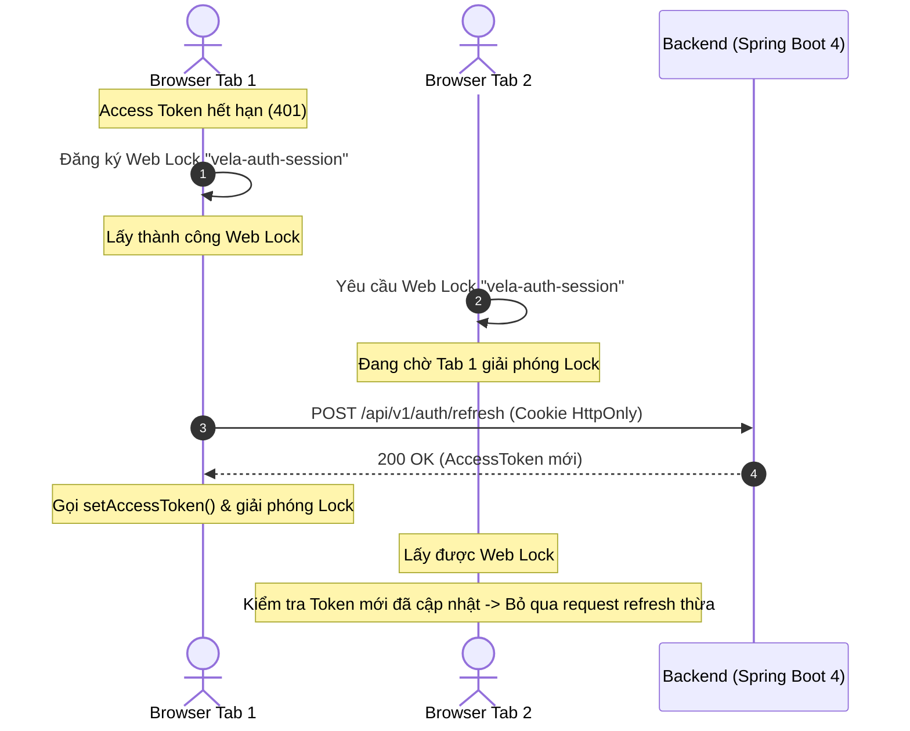
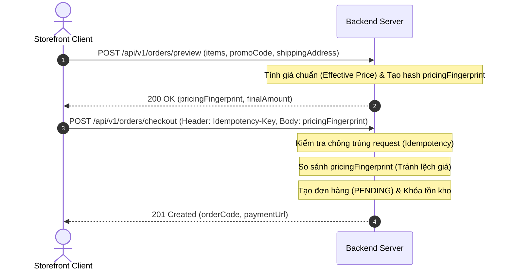

# Vela Wear Frontend

Storefront và admin dashboard cho ứng dụng thương mại điện tử thời trang cao cấp Vela Wear.

## Tech Stack

- **Core**: Next.js 16 (App Router, Turbopack), React 19, TypeScript
- **UI & Styling**: Tailwind CSS v4, shadcn/ui, Base UI, Lucide Icons, Motion
- **State & Data**: TanStack Query v5 (Server State), Zustand (Client State), Axios (Interceptors & Web Lock)
- **Forms & Validation**: React Hook Form, Zod
- **Testing**: Vitest (Unit Tests), Playwright (E2E Smoke & Fullstack)
- **Tooling**: Oxlint & Oxfmt (Rust-based), ESLint, Prettier

## Application Routes

Dự án được chia thành 3 phần chính:

- `app/(shop)/` — **Storefront**: Bao gồm trang chủ, danh sách sản phẩm, chi tiết sản phẩm, giỏ hàng, thanh toán, sale, flash-sale, tìm kiếm, yêu thích, mã giảm giá, đánh giá, hồ sơ người dùng, hướng dẫn chọn size, hỗ trợ.
- `app/(admin)/dashboard/` — **Admin Dashboard**: Các chức năng quản trị bao gồm ecommerce, analytics, finance, infrastructure, CRM, products, categories, brands, orders, users, roles, permissions, coupons, sales, tasks, kanban, calendar, chat, mail, productivity, invoice, coming-soon.
- `app/(auth)/` — **Authentication**: Đăng nhập, đăng ký, quên mật khẩu, OAuth2 callback.
- `app/unauthorized/` — Trang lỗi 403.

## Repository Structure

```text
app/
├── (shop)/           # Storefront routes
│   └── page.tsx      # Homepage
├── (admin)/dashboard/ # Admin dashboard routes
│   └── <screen>/
│       ├── page.tsx
│       └── _components/
├── (auth)/           # Auth routes
├── globals.css       # Tailwind theme
└── layout.tsx        # Root layout
components/
├── shop/             # Storefront components
├── ui/               # shadcn primitives
├── providers/        # Query, i18n, notification, cart, favourites
└── auth/             # Auth components & hooks
lib/
├── api-client.ts     # Axios instance, token mgmt, Web Lock, refresh
├── api/              # Types, helpers, transport layer
│   ├── client.ts     # apiGet, apiPost, apiPut, apiDelete, unwrap
│   ├── types.ts      # ApiResponse<T>, ResultPaginationDTO<T>, DTOs
│   ├── errors.ts     # Retry-After extraction
│   └── server.ts     # RSC server-side fetch
├── queries/          # TanStack Query hooks and cache keys
├── i18n/             # EN/VI locale system
│   └── messages/     # Route-scoped catalogs (core, shop, admin)
├── auth/             # Post-auth redirect, OTP flow
└── utils.ts          # cn() and shared utilities
hooks/                # Shared React hooks
styles/presets/       # Theme presets
scripts/              # Dev tooling (link checker)
docs/                 # Project documentation
plans/                # Implementation roadmap (12 plans, 5 waves)
```

## Auth Architecture

Hệ thống bảo mật và authentication được thiết kế chặt chẽ:

- **Access token**: Lưu trữ in-memory (biến module JavaScript), tuyệt đối KHÔNG lưu trong `localStorage`.
- **Refresh token**: Lưu dưới dạng HttpOnly cookie (trình duyệt không thể đọc qua JavaScript).
- **Single-flight token refresh**: Đảm bảo chỉ có một request refresh token diễn ra tại một thời điểm, các request khác sẽ đợi.
- **Web Lock API** (`navigator.locks.request('vela-auth-session')`): Đồng bộ hóa quá trình đăng nhập/refresh/đăng xuất giữa các tab.
- **Session generation guard**: Ngăn chặn tình trạng refresh token cũ ghi đè lên token mới sau khi đăng xuất.
- **OAuth2**: Hỗ trợ đăng nhập qua mạng xã hội (Google) với callback tại `/auth/oauth2/callback`.
- **Xác thực 2 bước**: Luồng OTP challenge/proof cho việc xác thực email.

## i18n

Hệ thống đa ngôn ngữ được tối ưu:

- Hỗ trợ song ngữ Tiếng Anh (EN) và Tiếng Việt (VI).
- Tối ưu hóa tải trang với **Route-scoped catalog splitting**: `catalog-core.ts`, `catalog-shop.ts`, `catalog-admin.ts`.
- Cấu trúc: `I18nProvider` ở root, `I18nCatalogProvider` ở các layout route group.
- **Admin content translation**: Cung cấp giao diện dịch thuật nội dung (VI/EN tabs) tích hợp công cụ tự động dịch bằng Gemini AI.

## Backend Integration

Dự án giao tiếp với Backend (`conqazht/VelaWear_BE`) thông qua các quy chuẩn nghiêm ngặt:

- **Base URL**: Cấu hình qua biến môi trường `NEXT_PUBLIC_API_URL` (bao gồm prefix `/api/v1`).
- **Response Format**: Tất cả phản hồi từ API đều được bọc trong `ApiResponse<T>` với các trường `statusCode`, `data`, `message`, `code`, `timestamp`.
- **Pagination**: Đánh chỉ mục từ 1 (`page=1`), bao gồm `size`, `sort=field,direction`.
- **Xử lý lỗi Validation (400)**: Field-level error map được trả về trong payload `data`.
- **Xử lý lỗi Authorization (401)**: Interceptor tự động bắt lỗi 401 → thực hiện single-flight refresh → retry request bị lỗi hoặc chuyển hướng người dùng về trang `/sign-in`.
- **Rate Limit (429)**: React Query tự động xử lý thời gian đợi retry thông qua header/body `Retry-After` (đơn vị: giây).
- **Self-scoped APIs**: Các API dành cho khách hàng sử dụng path nội bộ như `/users/me`, `/orders/me`, v.v.
- Để xem hướng dẫn chi tiết về tích hợp API, tham khảo [Quy ước tích hợp FE-BE](docs/convention.md).

## Luồng Tích Hợp End-to-End (FE ↔ BE Flow)

Kiến trúc tương tác giữa Frontend client và Spring Boot backend đảm bảo an toàn session và toàn vẹn dữ liệu:

### 1. Quản Lý Session & Web Lock Serialization



### 2. Luồng Checkout an toàn dữ liệu (Pricing Fingerprint & Idempotency)



## Setup Instructions

Các bước cài đặt để chạy dự án ở môi trường phát triển:

1. **Yêu cầu hệ thống**: Đảm bảo bạn đã cài đặt Node.js 24 và pnpm 11.5.2.
2. Clone repository về máy.
3. Cài đặt các dependencies:
   ```bash
   pnpm install --frozen-lockfile
   ```
4. Copy file cấu hình môi trường:
   Sao chép `.env.example` thành `.env.local` và điều chỉnh các biến số nếu cần thiết.
   ```text
   NEXT_PUBLIC_API_URL=http://localhost:8080/api/v1
   NEXT_PUBLIC_BACKEND_ORIGIN=http://localhost:8080
   ```
5. Chạy development server:
   ```bash
   pnpm dev
   ```
   (Server sẽ khởi chạy tại cổng 3000).
6. Build cho môi trường production:
   ```bash
   pnpm build
   ```

## Default Test Accounts (Dev Seed Data)

Khi kết nối với Backend Spring Boot và cơ sở dữ liệu mẫu (dev seed database), bạn có thể sử dụng các tài khoản kiểm thử sau:

| Vai trò / Phân quyền              | Email                  | Mật khẩu mặc định | Mục đích kiểm thử / Ghi chú                                            |
| :-------------------------------- | :--------------------- | :---------------- | :--------------------------------------------------------------------- |
| **Admin** (Quản trị viên)         | `admin@velawear.local` | `Password123!`    | Toàn quyền truy cập Admin Dashboard (`/dashboard/*`, `ROLE_ADMIN`)     |
| **Staff** (Nhân viên)             | `staff@velawear.local` | `Password123!`    | Quản lý sản phẩm, đơn hàng, khách hàng (`ROLE_STAFF`)                  |
| **Customer 1** (Khách hàng chính) | `user@velawear.local`  | `Password123!`    | Storefront shopping, giỏ hàng, checkout, profile cá nhân (`ROLE_USER`) |
| **Customer 2** (Khách hàng phụ)   | `linh@velawear.local`  | `Password123!`    | Kiểm thử đa tài khoản, self-scoped ownership isolation (`ROLE_USER`)   |

## Available Scripts

Dưới đây là các lệnh (scripts) khả dụng trong `package.json`:

| Script                    | Lệnh thực thi                                   | Mục đích                                                 |
| ------------------------- | ----------------------------------------------- | -------------------------------------------------------- |
| `pnpm dev`                | `next dev`                                      | Chạy dev server với Turbopack                            |
| `pnpm build`              | `next build`                                    | Build dự án cho production                               |
| `pnpm start`              | `next start`                                    | Khởi chạy server production                              |
| `pnpm format`             | `prettier --write .`                            | Định dạng toàn bộ codebase & sắp xếp class Tailwind      |
| `pnpm format:check`       | `prettier --check .`                            | Kiểm tra định dạng Prettier & Tailwind (trên CI)         |
| `pnpm fmt`                | `oxfmt .`                                       | Tự động format toàn bộ codebase bằng oxfmt (Rust)        |
| `pnpm fmt:check`          | `oxfmt --check .`                               | Kiểm tra định dạng code oxfmt                            |
| `pnpm lint:fast`          | `oxlint --deny-warnings`                        | Kiểm tra lỗi cú pháp & logic siêu nhanh (20ms)           |
| `pnpm lint`               | `eslint`                                        | Kiểm tra quy tắc ESLint 9 & Next.js Core Web Vitals      |
| `pnpm test`               | `pnpm test:unit`                                | Chạy bộ unit tests                                       |
| `pnpm test:unit`          | `vitest run`                                    | Chạy unit tests một lần                                  |
| `pnpm test:unit:watch`    | `vitest`                                        | Chạy unit tests ở chế độ watch                           |
| `pnpm test:coverage`      | `vitest run --coverage`                         | Chạy tests và xuất báo cáo coverage                      |
| `pnpm test:e2e`           | `playwright test --grep @smoke`                 | Chạy E2E smoke tests                                     |
| `pnpm test:e2e:smoke`     | `playwright test --grep @smoke`                 | Chạy smoke tests (không yêu cầu backend)                 |
| `pnpm test:e2e:fullstack` | `playwright test --grep @fullstack --workers=1` | Chạy Full-stack E2E tests (yêu cầu backend, DB và Redis) |

## CI Pipeline (GitHub Actions)

Dự án thiết lập CI workflow tự động chạy trên mọi Pull Request và khi push vào nhánh `main`:

- Môi trường: pnpm 11.5.2, Node 24
- Cài đặt dependency: `pnpm install --frozen-lockfile`
- Format check (Fast): `pnpm fmt:check` (oxfmt Rust, kiểm tra 600+ files trong 1.2s)
- Fast Lint (Fast): `pnpm lint:fast` (oxlint Rust, quét 540+ files trong 20ms)
- Framework Linter: `pnpm exec eslint . --max-warnings 25`
- Type checking: `pnpm exec tsc --noEmit`
- Unit Test: `pnpm test:unit` (Chạy 60 files, 262 tests)
- Build: `pnpm build` (Build 68 static routes)
- E2E Smoke Test: Playwright smoke suite (Chạy 19 cases, Next.js được tự động start)

## Testing Stats

Hệ thống test đảm bảo chất lượng codebase:

- **Unit Testing**: 60 unit test suites, 262 tests sử dụng Vitest và Testing Library (100% passed).
- **Smoke Testing**: 19 Playwright smoke cases có thể chạy độc lập mà không cần backend (100% passed).
- **Full-stack Testing**: 9 Playwright full-stack test cases kiểm thử contract thật với Spring Boot backend, PostgreSQL và Redis (100% passed).
- Chi tiết xem tại: [Hướng dẫn Playwright và CI full-stack](docs/PLAYWRIGHT_CI_VI.md)

## Documentation References

Các tài liệu quan trọng của dự án:

- [Hệ thống thiết kế UI/UX (Design System)](docs/DESIGN.md): Bảng màu thương hiệu (Cream/Terracotta), typography (Slab-serif/Sans-serif), spacing, radius và quy chuẩn phong cách editorial.
- [Tiến độ dự án](docs/PROJECT_STATUS.md)
- [Quy ước tích hợp FE-BE](docs/convention.md): Hướng dẫn quy chuẩn tích hợp giữa Frontend và Backend (Base URL `/api/v1`, định dạng phản hồi `ApiResponse<T>`, xử lý lỗi, token authentication và customer self-scoped endpoints).
- [Playwright và CI full-stack](docs/PLAYWRIGHT_CI_VI.md)
- [Sale campaign frontend](docs/SALE_CAMPAIGN_FRONTEND.md)
- [Storefront catalog UX](docs/STOREFRONT_CATALOG_UX_FRONTEND_VI.md)
- [Quản trị nội dung i18n](docs/I18N_ADMIN_GUIDE_VI.md)
- [Kế hoạch bổ sung Race-Condition tests & Playwright CI](docs/PLAN_RACE_CONDITION_PLAYWRIGHT_CI_VI.md)
