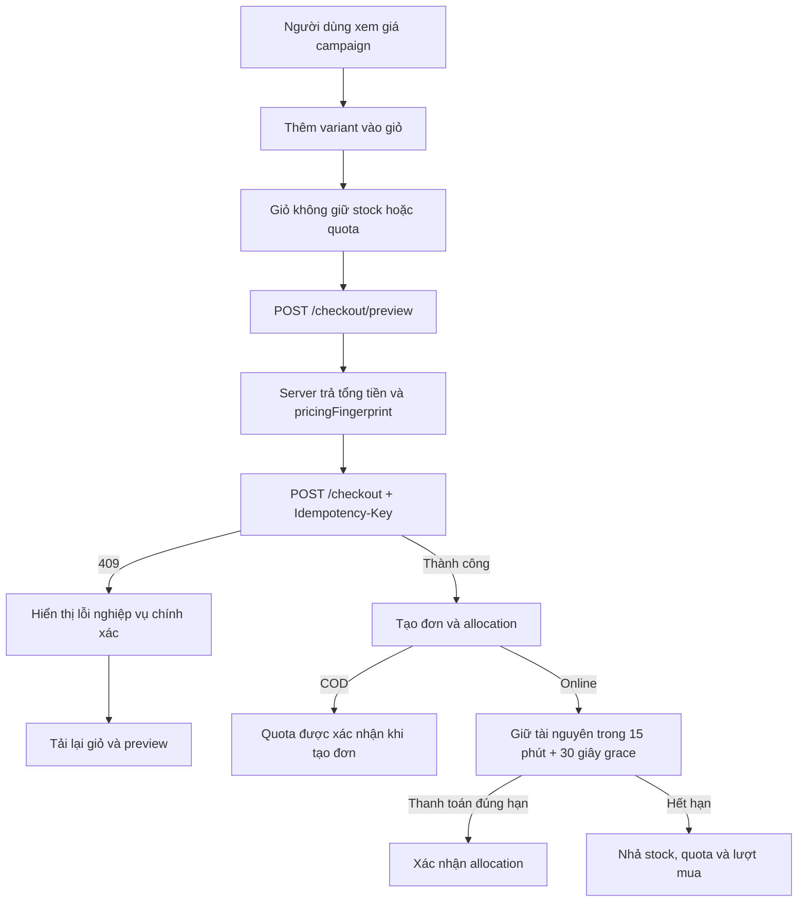

# Sale Campaign Frontend

Tài liệu này mô tả nghiệp vụ và cách frontend triển khai tính năng Sale Campaign. Mục tiêu là giúp người mới có thể hiểu vì sao hệ thống được thiết kế như vậy, cách lần theo code và cách mở rộng mà không làm sai giá hoặc quota.

## 1. Phạm vi nghiệp vụ

Hệ thống chỉ còn một nguồn giảm giá là **campaign**. Thuộc tính `product_variants.sale_price` cũ đã bị loại bỏ; admin không thể gõ một giá sale vô thời hạn trực tiếp trên variant nữa.

Một campaign có thể chứa một hoặc nhiều variant thuộc một hoặc nhiều sản phẩm:

- `STANDARD`: sale theo lịch, không có quota và giới hạn mua theo khách; phần giá trị đủ điều kiện vẫn có thể dùng coupon.
- `FLASH`: sale theo lịch, có tổng quota và có thể đặt giới hạn mua tích lũy cho mỗi khách; không áp dụng coupon lên dòng Flash.

Coupon là module riêng. Màn hình quản lý coupon cũ không nằm trong màn hình quản lý campaign.

Thứ tự chọn giá tại một thời điểm là:

```text
FLASH đang LIVE và còn khả dụng > STANDARD đang LIVE > BASE
```

Backend là nguồn sự thật của giá, quota, giới hạn khách hàng, phí vận chuyển và coupon. Frontend chỉ trình bày dữ liệu và gửi ý định mua.

## 2. Hai loại trạng thái cần phân biệt

`status` được lưu trong database:

- `DRAFT`: bản nháp.
- `PUBLISHED`: đã xuất bản.
- `CANCELLED`: đã hủy.

`phase` được tính từ `status`, `startsAt`, `endsAt` và thời gian hiện tại:

- `UPCOMING`: đã publish nhưng chưa tới giờ bắt đầu.
- `LIVE`: đang trong khung giờ hoạt động.
- `ENDED`: đã hết giờ hoặc đã hủy/kết thúc sớm.

Không lưu `UPCOMING/LIVE/ENDED` như một cột độc lập vì chúng tự thay đổi theo thời gian. Nếu lưu, một campaign có thể vẫn mang giá trị `LIVE` dù đồng hồ đã qua `endsAt`.

Helper liên quan nằm tại `lib/sale-utils.ts`. Đồng hồ đếm ngược sử dụng `serverTime` để bù sai lệch đồng hồ thiết bị của người dùng.

## 3. Sơ đồ luồng mua hàng



Điểm quan trọng: việc còn hiển thị “5 suất” trên trình duyệt không bảo đảm DB vẫn còn 5 suất tại thời điểm click đặt hàng. Vì vậy checkout luôn phải kiểm tra nguyên tử ở backend và FE phải xử lý `409` rõ ràng.

## 4. Cấu trúc code

### Public storefront

- `app/(shop)/sale/page.tsx`: trang Standard Sale.
- `app/(shop)/flash-sale/page.tsx`: trang Flash Sale.
- `components/shop/sale-landing.tsx`: danh sách campaign, countdown, quota và card sản phẩm.
- `lib/api/sales.ts`: public API `/sales`.
- `lib/queries/sales.ts`: cache/polling React Query.
- `lib/sale-utils.ts`: phase, countdown, bù đồng hồ server và gộp variant theo sản phẩm.
- `components/shop/product-detail-client.tsx`: giá hiệu lực, campaign, quota và giải thích thời điểm backend xác nhận giới hạn khách.
- `components/shop/cart-page-client.tsx`: cảnh báo giỏ không giữ suất và trần số lượng mang tính gợi ý.
- `components/shop/checkout-page-client.tsx`: preview, idempotency, xử lý xung đột và hạn thanh toán.
- `app/(shop)/profile/orders/[code]/order-details-client.tsx`: hiển thị snapshot giá/campaign của đơn.

### Admin

- `app/(admin)/dashboard/sales`: route quản lý campaign.
- `app/(admin)/dashboard/sales/_components`: danh sách, editor nhiều bước, chọn variant và các dialog action.
- `app/(admin)/dashboard/sales/_data`: schema/form mapping và helper.
- `lib/api/admin-sales.ts`: contract API admin.
- `lib/queries/admin-sales.ts`: query/mutation và invalidation cache.

### Kiểu dữ liệu dùng chung

Các kiểu `Pricing`, `PriceSource`, `SaleCampaign`, `SaleCampaignItem` nằm trong `lib/api/types.ts`.

`Pricing` tối thiểu gồm:

- `listPrice`: giá niêm yết/base để gạch ngang.
- `effectivePrice`: giá thực tế đang bán.
- `priceSource`: `BASE`, `STANDARD_SALE` hoặc `FLASH_SALE`.
- thông tin campaign, thời gian, quota, giới hạn khách, `availableQuantity` và `couponEligible` khi có.

Không tự tính `effectivePrice` bằng phần trăm ở FE. Giá promotional do admin nhập và backend đã chọn theo precedence.

`pricing` ở cấp product chỉ đại diện cho variant có giá hiệu lực tốt nhất để hiển thị card. Khi người dùng đã chọn màu/size, trang chi tiết chỉ dùng `pricing` của đúng variant đó; không fallback sang campaign của variant khác. Quick-add bị đổi thành “Chọn biến thể” đối với sản phẩm Sale để tránh thêm nhầm variant/giá.

`availableQuantity` là field canonical do backend tính. Ở public campaign, nó bằng lượng có thể bán theo stock và quota của variant, chưa cá nhân hóa theo tài khoản. Khi gộp nhiều variant thành một card sản phẩm, FE cộng `availableQuantity`; card được đánh dấu “Hết hàng” nếu tổng bằng 0, hoặc “Đã hết suất” nếu quota Flash bằng 0.

Catalog công khai không bảo đảm có `customerRemaining`. Vì vậy product page chỉ khóa sớm khi backend thực sự trả giá trị `0`; nếu field chưa có, UI phải nói rõ lượt mua còn lại được xác nhận tại giỏ hàng/checkout, không được hứa rằng tài khoản vẫn còn lượt.

## 5. Public API

### Danh sách campaign

```http
GET /api/v1/sales?type=STANDARD&locale=vi
GET /api/v1/sales?type=FLASH&locale=en
GET /api/v1/sales?type=FLASH&phase=LIVE&phase=UPCOMING&locale=vi
```

Khi lọc nhiều phase, FE serialize thành nhiều query parameter cùng tên như ví dụ trên để Spring bind đúng vào `List<SaleCampaignPhase>`; không dùng `phase[]=...`.

`locale` lấy từ i18n provider và là một phần của React Query key. Vì vậy VI và EN có cache tách biệt, không dùng dữ liệu placeholder của locale trước khi người dùng đổi ngôn ngữ. Nếu campaign chưa có EN, backend trả nội dung VI fallback. Trang Standard/Flash đồng thời cập nhật title và meta description ở client theo locale hiện tại mà không cần URL prefix.

Payload:

```json
{
  "serverTime": "2026-07-15T08:00:00Z",
  "campaigns": []
}
```

Frontend lọc `LIVE` cho Standard, và `LIVE + UPCOMING` cho Flash. Query Flash được làm mới thường xuyên hơn; khi tới biên `startsAt/endsAt`, UI chủ động invalidate cache.

### Chi tiết campaign

```http
GET /api/v1/sales/{code}?locale=en
```

## 6. API và quyền chỉnh sửa ở admin

Các action chính:

- tạo, đọc, sửa và xóa draft tại `/sale-campaigns`;
- publish/cancel campaign;
- sửa display khi LIVE;
- tăng quota Flash khi LIVE;
- kết thúc sớm;
- kết thúc và clone campaign mới.

Mọi lệnh sửa mang theo `version` để optimistic locking. Khi hai admin cùng mở một campaign, người gửi dữ liệu cũ sẽ nhận conflict thay vì âm thầm ghi đè.

Nội dung campaign có tab `Tiếng Việt | English` độc lập với ngôn ngữ giao diện admin. `code`, banner, type, schedule, items, price và quota là dữ liệu dùng chung; chỉ `name` và `description` được dịch. VI bắt buộc, EN tùy chọn và việc thiếu EN không chặn publish.

Raw translation dùng các endpoint sau:

```http
GET    /api/v1/sale-campaigns/{id}/translations
PUT    /api/v1/sale-campaigns/{id}/translations
DELETE /api/v1/sale-campaigns/{id}/translations/{locale}?version={version}
```

Batch PUT gửi `{ "version": n, "translations": [...] }` và nhận lại `version` mới. Nếu admin xóa toàn bộ nội dung English, FE dùng version mới nhất để DELETE locale `en`. Lifecycle campaign không thay đổi bởi tính năng i18n.

Quy tắc UI:

- `DRAFT`: sửa toàn bộ và xóa được.
- `PUBLISHED + UPCOMING`: sửa toàn bộ; backend kiểm tra lại overlap và tăng `version`.
- `LIVE`: chỉ sửa tên/mô tả/banner, tăng quota, kết thúc sớm hoặc end-and-clone.
- `ENDED/CANCELLED`: chỉ xem; muốn đổi sản phẩm/giá phải clone thành campaign mới.

Editor kiểm tra sớm giá promotional phải nhỏ hơn giá tham chiếu. Với Flash, quota là bắt buộc và giới hạn mỗi khách là tùy chọn. Backend vẫn lặp lại toàn bộ validation vì FE không phải ranh giới bảo mật.

## 7. Checkout an toàn khi có cạnh tranh

### Preview và pricing fingerprint

`POST /checkout/preview` trả:

- giá từng item;
- snapshot campaign phẳng và object `pricing` lồng nhau của từng item;
- subtotal và phần subtotal đủ điều kiện coupon;
- phí vận chuyển;
- discount/final amount;
- `pricingFingerprint` đại diện cho bản chụp giá hiện tại.

Preview chỉ cần `{ paymentMethod: "COD" | "SEPAY", couponCode? }`; thông tin giao nhận được validate ở lệnh tạo đơn.

Ngay trước submit, FE preview lại và gửi fingerprint vào `POST /checkout`. Nếu campaign vừa kết thúc hoặc giá vừa đổi, backend trả `PRICE_CHANGED` thay vì tạo đơn theo giá mà người dùng chưa nhìn thấy.

### Idempotency key

Mỗi ý định submit có header:

```http
Idempotency-Key: <UUID>
```

Double click, retry mạng hoặc người dùng bấm lại cùng request không được tạo hai đơn. Nếu nội dung request đổi, FE tạo key mới. Nếu backend trả lỗi nghiệp vụ xác định, key cũ bị bỏ.

Nếu server đã tạo đơn nhưng response bị mất, FE giữ nguyên cả request có fingerprint và idempotency key để retry. Không preview lại ở lần retry này vì server có thể đã xóa giỏ sau khi tạo đơn; backend phải replay đúng order cũ và tái tạo payment initiation khi đơn SePay vẫn đang chờ thanh toán.

### Mã lỗi ổn định

`lib/checkout-api.ts` ưu tiên field `code`; không phụ thuộc câu chữ trong `message`.

| HTTP/code | Ý nghĩa trên UI |
| --- | --- |
| `409 INSUFFICIENT_STOCK` | Tồn kho không đủ, tải lại giỏ |
| `409 FLASH_SALE_SOLD_OUT` | Quota vừa hết |
| `409 FLASH_SALE_ENDED` | Campaign vừa kết thúc |
| `409 FLASH_SALE_LIMIT_EXCEEDED` | Vượt tổng lượt mua của khách |
| `409 PRICE_CHANGED` | Giá/fingerprint đã đổi |
| `409 IDEMPOTENCY_KEY_REUSED` | Cùng key nhưng payload khác |

Sau các conflict liên quan dữ liệu, FE gọi lại `/carts/me` và `/checkout/preview`. Người dùng thấy lý do cụ thể và tổng mới; hệ thống không tự đặt hàng lại.

### Online payment

Response tạo đơn có `paymentDueAt` và `reservationExpiresAt`. UI đếm ngược theo giờ server:

- 15 phút để thanh toán;
- 30 giây grace để IPN đang trên đường tới server được xử lý;
- sau mốc release, stock/quota/lượt mua được nhả;
- thanh toán tới muộn không tự hồi sinh đơn, backend chuyển sang quy trình hoàn tiền.

Khi qua `reservationExpiresAt`, UI ẩn nút tiếp tục thanh toán để không chủ động tạo một giao dịch muộn. Hủy đơn từ trang lịch sử gọi command `POST /checkout/{orderId}/cancel`, không sửa status bằng endpoint order tổng quát, nhờ đó backend có một chỗ duy nhất để đảo stock/quota/coupon.

Order detail còn đọc `resourcesReleasedAt`. Sau khi người dùng tải lại trang, UI vẫn hiển thị hạn thanh toán, mốc giữ tài nguyên và thời điểm stock/quota/lượt mua đã được nhả; không suy luận release chỉ từ đồng hồ phía client.

## 8. Coupon

Standard Sale có thể kết hợp coupon nếu coupon thỏa điều kiện. Flash Sale không được tính vào `couponEligibleSubtotal`.

Một giỏ có cả Flash và Standard/Base vẫn có thể dùng coupon cho phần đủ điều kiện. Vì vậy FE không khóa toàn bộ ô coupon chỉ vì thấy một item Flash; UI giải thích rõ phần Flash bị loại và dùng kết quả preview từ backend.

## 9. Cache và dữ liệu theo thời gian

Sale là dữ liệu nhạy cảm với thời gian nên không dùng stale time mặc định 5 phút:

- public Flash polling 15 giây, stale sau 5 giây;
- product detail và variant polling 15 giây;
- dữ liệu SSR product revalidate 5–15 giây;
- checkout luôn preview lại ngay trước khi ghi đơn.

Polling chỉ giúp UI bớt cũ, không thay thế transaction/conditional update ở backend.

Mutation bản dịch admin invalidate cả danh sách/chi tiết admin và public Sale. Public query key chứa locale; metadata client cũng được tính lại khi locale hoặc loại Sale thay đổi.

## 10. Chạy kiểm thử

```bash
pnpm test:unit
pnpm test:coverage
pnpm exec playwright install chromium
pnpm test:e2e
pnpm lint
pnpm build
```

Test hiện có bao phủ:

- cách tính phase/countdown và bù đồng hồ server;
- gộp variant/quota/`availableQuantity` thành card sản phẩm và phân biệt hết stock với hết suất;
- serialize nhiều `phase` thành query parameter lặp;
- serialize `locale` vào public Sale API và tách query key theo locale;
- serialization VI/EN, EN tùy chọn và translation endpoint có optimistic `version`;
- tab nội dung VI/EN và metadata Sale theo locale;
- status toggle mapping và rollback cache khi PATCH lỗi;
- mapping stable checkout error codes;
- nội dung nghiệp vụ của trang Standard/Flash bằng React Testing Library;
- smoke test hai route Sale bằng Playwright.

Các kịch bản race condition thật phải được test ở backend với PostgreSQL/Testcontainers; unit test FE không thể chứng minh hai transaction đồng thời chỉ trừ quota một lần.

## 11. Checklist khi mở rộng

Khi thêm một loại sale hay rule mới, cần rà đủ các điểm sau:

1. Backend chọn giá và trả `priceSource`; FE không tự suy đoán.
2. Cart API trả lại canonical price/quota sau mỗi lần đồng bộ.
3. Preview và checkout dùng cùng engine tính giá.
4. Stable error code có mapping và test.
5. Snapshot order item đủ để đọc lại sau khi campaign bị sửa/xóa.
6. Đồng hồ dùng `serverTime` và có xử lý qua biên thời gian.
7. Admin action có `version` và giới hạn field theo phase.
8. Coupon chỉ tính trên eligible subtotal do backend trả.
9. Không coi Redis, localStorage hoặc dữ liệu React Query là nguồn quota chính thức.
