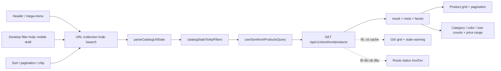

# Storefront Catalog UX — tài liệu frontend

> **Ngày cập nhật:** 2026-07-16
> **OpenSpec change ID:** `complete-storefront-catalog-ux`
> **Repository:** `commercial-fe`
> **Tài liệu companion:** [Storefront Catalog UX — backend](../../commercial-be-storefront-catalog-ux/docs/STOREFRONT_CATALOG_UX_BACKEND_VI.md)

Tài liệu này là điểm bắt đầu khi bảo trì Collection, Search, mega-menu, Size Guide,
đánh giá sản phẩm và trạng thái lỗi storefront. Tên class, field, endpoint và code
được giữ bằng tiếng Anh; phần giải thích dùng tiếng Việt.

## Mục lục

1. [Mục tiêu, phạm vi và quyết định đã khóa](#1-mục-tiêu-phạm-vi-và-quyết-định-đã-khóa)
2. [Kiến trúc và luồng dữ liệu](#2-kiến-trúc-và-luồng-dữ-liệu)
3. [Route, URL state và catalog API](#3-route-url-state-và-catalog-api)
4. [Bộ lọc, sắp xếp và phân trang](#4-bộ-lọc-sắp-xếp-và-phân-trang)
5. [Mega-menu](#5-mega-menu)
6. [Size Guide](#6-size-guide)
7. [Đánh giá sản phẩm](#7-đánh-giá-sản-phẩm)
8. [Loading, error, stale data và retry](#8-loading-error-stale-data-và-retry)
9. [Responsive, accessibility và i18n](#9-responsive-accessibility-và-i18n)
10. [Visual QA](#10-visual-qa)
11. [Lỗi thường gặp và cách điều tra](#11-lỗi-thường-gặp-và-cách-điều-tra)
12. [Kiểm thử và Playwright artifact](#12-kiểm-thử-và-playwright-artifact)
13. [Cấu trúc file và checklist mở rộng](#13-cấu-trúc-file-và-checklist-mở-rộng)
14. [Nếu cần sửa sau này](#14-nếu-cần-sửa-sau-này)

## 1. Mục tiêu, phạm vi và quyết định đã khóa

### 1.1 Mục tiêu

- Collection và Search dùng cùng một catalog controller, cùng quy tắc filter, sort,
  phân trang, facets và effective price.
- URL là nguồn trạng thái để reload hoặc mở link mới vẫn tái tạo đúng kết quả.
- Header có đầy đủ leaf link thật; parent label là link, chevron chỉ làm nhiệm vụ mở
  menu.
- PDP có Size Guide riêng, preview ba review và modal xem đầy đủ review.
- Khách chỉ viết review từ item thuộc đơn `COMPLETED`; ảnh được gửi dưới dạng file.
- Lỗi lần tải đầu dùng artwork lớn dưới header; lỗi refetch có cache không làm mất
  nội dung đang xem.

### 1.2 Phạm vi đã triển khai

- `/collection` và `/search` với multi-filter, facets, sort, chip, phân trang và URL
  rollback khi filter mới thất bại.
- Mega-menu desktop và accordion mobile từ một cấu hình dùng chung.
- `/size-guide` với trang phục, plus-size, quy đổi quốc tế, giày và phụ kiện.
- Preview review trên PDP, modal gần toàn màn hình, lightbox và review URL state.
- Form viết review trong chi tiết đơn hàng, preview/xóa ảnh và cache invalidation.
- Phân loại lỗi HTTP/network/cancel/unknown, retry có giới hạn, stale warning và
  route-level status.

### 1.3 Quyết định đã khóa

- Không dùng API admin `/products` cho Collection/Search. Hai trang phải gọi
  `GET /api/v1/storefront/products`.
- Bốn sort công khai là `featured`, `newest`, `price-asc`, `price-desc`; không đổi
  `price-asc` thành `sort=price`.
- Desktop áp filter ngay; mobile giữ `mobileDraft` rồi mới ghi vào URL khi bấm
  **Xem N sản phẩm**.
- Preview PDP luôn lấy tối đa ba review mới nhất và không hiển thị ảnh.
- Modal review lấy 10 review mỗi trang từ server; không tải toàn bộ rồi phân trang
  trong browser.
- Review chỉ tạo mới. Edit, delete và moderation không nằm trong phạm vi change này.
- Size Guide là dữ liệu tĩnh versioned trong repository; ứng dụng không scrape H&M
  hoặc Nike lúc runtime.
- Mutation không tự retry. Query chỉ retry tối đa một lần theo bảng ở mục 8.

## 2. Kiến trúc và luồng dữ liệu



Các lớp chính:

- `lib/storefront-navigation.ts`: cấu hình navigation và tạo leaf URL.
- `lib/storefront-catalog.ts`: parse/serialize URL, map URL sang API filter, validate
  price và xác định URL rollback.
- `lib/api/catalog.ts`: HTTP adapter; biến array thành CSV cho backend.
- `lib/queries/catalog.ts`: query key, cache và policy `refetchOnWindowFocus: false`
  riêng cho storefront catalog.
- `components/shop/collection-client.tsx`: controller UI dùng chung cho Collection
  và Search.

## 3. Route, URL state và catalog API

### 3.1 Danh sách route liên quan

| Route                    | Vai trò                                                            |
| ------------------------ | ------------------------------------------------------------------ |
| `/collection`            | Danh mục chung, filter/facets/sort/pagination                      |
| `/search`                | Kết quả tìm kiếm; dùng cùng `CollectionClient` với `mode="search"` |
| `/products/[id]`         | PDP, link Size Guide và review preview/modal                       |
| `/size-guide`            | Bảng cỡ tham khảo theo category/product/size                       |
| `/sale`                  | Standard Sale storefront                                           |
| `/flash-sale`            | Flash Sale storefront                                              |
| `/favorites`             | Danh sách yêu thích                                                |
| `/coupons`               | Coupon của khách                                                   |
| `/reviews`               | Lịch sử review của tài khoản hiện tại                              |
| `/profile?tab=orders`    | Danh sách đơn hàng                                                 |
| `/profile/orders/[code]` | Chi tiết đơn và CTA viết review                                    |

### 3.2 Query param công khai của Collection/Search

| URL param    | Kiểu                 | Mặc định   | API param       | Quy tắc                                |
| ------------ | -------------------- | ---------- | --------------- | -------------------------------------- |
| `q`          | string               | rỗng       | `q`             | trim, tối đa 160 ký tự                 |
| `categories` | CSV slug             | rỗng       | `categorySlugs` | loại trùng, giữ nhiều slug             |
| `colors`     | CSV positive integer | rỗng       | `colorIds`      | bỏ ID lỗi, âm hoặc bằng 0              |
| `sizes`      | CSV positive integer | rỗng       | `sizeIds`       | bỏ ID lỗi, âm hoặc bằng 0              |
| `minPrice`   | number >= 0          | bỏ trống   | `minPrice`      | không cho lớn hơn `maxPrice` khi apply |
| `maxPrice`   | number >= 0          | bỏ trống   | `maxPrice`      | không cho nhỏ hơn `minPrice` khi apply |
| `sort`       | enum                 | `featured` | `sort`          | chỉ nhận bốn giá trị đã khóa           |
| `page`       | positive integer     | `1`        | `page`          | 1-based                                |

Frontend gửi thêm `size=12` và `locale` hiện tại. `lib/api/catalog.ts` serialize các
array thành CSV trước khi gọi API. Response được unwrap từ `ApiResponse<T>` và có
dạng dữ liệu chính:

```ts
type StorefrontCatalogResult = {
  result: Product[];
  meta: { page: number; pageSize: number; pages: number; total: number };
  facets: {
    categories: Array<{ id: number; name: string; slug: string; count: number }>;
    colors: Array<{ id: number; name: string; hexCode?: string; count: number }>;
    sizes: Array<{ id: number; name: string; count: number }>;
    priceRange: { min: number | null; max: number | null };
  };
};
```

Quy tắc OR trong cùng nhóm, AND giữa các nhóm, điều kiện cùng variant, effective
price và featured ranking là trách nhiệm của backend; xem tài liệu companion.

### 3.3 URL mẫu

```text
/collection?categories=ao%2Cao-khoac&colors=1%2C2&sizes=3%2C4&minPrice=200000&maxPrice=900000&sort=price-asc&page=2

/search?q=linen&categories=ao&sort=newest
```

URL do `URLSearchParams` tạo nên dấu phẩy có thể hiển thị thành `%2C`; hai dạng có
nghĩa tương đương khi parse.

### 3.4 Back, forward, reload và link từ header

- Mỗi render đọc lại `useSearchParams`; state filter không được lưu trong một store
  riêng. Vì vậy reload hoặc mở URL ở tab mới tái tạo đúng filter/sort/page.
- Filter, sort và pagination dùng `router.replace(..., { scroll })` để cập nhật URL
  hiện tại mà không tạo hàng chục history entry. Vì dùng `replace`, nút Back không
  quay qua từng lần tick filter; nó quay về entry trước khi vào catalog.
- Link ở header dùng `Link`, tạo navigation entry bình thường. Back/Forward giữa
  PDP, Search, Collection hoặc các link header sẽ parse lại URL và phục hồi view.
- Khi filter mới lỗi nhưng query còn placeholder/cache, `CollectionClient` thay URL
  bằng query thành công gần nhất. Cảnh báo vẫn cho phép thử lại query đã thất bại.
- Default không cần ghi vào URL: `sort=featured` và `page=1` được bỏ khi serialize.

## 4. Bộ lọc, sắp xếp và phân trang

### 4.1 Facets và multi-select

- Danh mục dùng slug; màu và size dùng numeric ID.
- Click một giá trị sẽ toggle nó, không làm mất các giá trị khác trong cùng nhóm.
- Count hiển thị trực tiếp từ `facets`; không tự tính từ 12 sản phẩm của trang hiện
  tại.
- Chip **Đang lọc** cho phép xóa từng category/color/size/min/max. **Xóa tất cả**
  giữ nguyên `q` và `sort`, nhưng xóa facets/price và đưa `page` về 1.
- Mọi thay đổi filter hoặc sort đều reset `page=1`.

### 4.2 Giá

- Input nhận số không âm; Enter hoặc blur sẽ commit ở desktop.
- Nếu `minPrice > maxPrice`, UI giữ giá trị nhập, hiện validation và không cập nhật
  URL/query.
- Khoảng min/max gợi ý bên dưới input lấy từ `facets.priceRange` và format theo
  locale.
- Frontend không tự tính sale price để lọc; backend là nguồn effective price duy
  nhất cho grid, facets và sort.

### 4.3 Desktop và mobile

- Desktop: sidebar có các section collapsible; thay đổi lập tức gọi query mới.
- Mobile: mở right-side dialog, copy URL state sang `mobileDraft`. Các tick chỉ sửa
  draft. Query preview dùng `size=1` để lấy `meta.total`; nút **Xem N sản phẩm** mới
  apply draft vào URL.
- Escape hoặc backdrop đóng dialog. Apply bị disable khi range giá không hợp lệ hoặc
  preview query đang fetch.

### 4.4 Sort và pagination

| Giá trị      | Nhãn VI          | Ý nghĩa contract                |
| ------------ | ---------------- | ------------------------------- |
| `featured`   | Nổi bật          | Ranking nổi bật do backend tính |
| `newest`     | Mới nhất         | Sản phẩm mới trước              |
| `price-asc`  | Giá thấp đến cao | Effective price tăng dần        |
| `price-desc` | Giá cao đến thấp | Effective price giảm dần        |

Pagination hiển thị trang đầu, trang hiện tại ±1, trang cuối, Previous/Next và dấu
ellipsis. Sau khi đổi trang, viewport cuộn về anchor catalog có trừ chiều cao header.

## 5. Mega-menu

### 5.1 Cấu trúc hiện tại

Nguồn duy nhất là `getStorefrontNavigation(locale)` trong
`lib/storefront-navigation.ts`.

- **Giảm giá:** Tất cả ưu đãi, Flash Sale.
- **Bộ sưu tập:** Tất cả sản phẩm, Mới về, Thiết yếu, Linen, May đo, Dệt kim & Len.
- **Áo:** Áo thun, Polo, Sơ mi, Blouse, Áo len, Cardigan, Áo cổ lọ, Tất cả áo
  khoác, Blazer & Suit, Trench & Overcoat, Bomber & Parka.
- **Quần:** Tất cả quần, Quần tây, Quần linen, Chinos, Cargo, Ống rộng.
- **Váy & Đầm:** Tất cả váy, Váy midi, Váy maxi, Váy bút chì, Tất cả đầm, Đầm
  linen, Đầm midi, Đầm maxi, Jumpsuit.
- **Phụ kiện & Giày:** Tất cả giày, Derby/Oxford/Loafer, Sneaker/Slip-on,
  Sandal/Mule, Túi, Ví, Thắt lưng, Vòng, Móc khóa.
- **Trợ giúp:** `/help`.

Desktop có rail trái với border terracotta và đúng một CTA cam
`Xem tất cả … →`; không có dòng phụ “Khám phá bộ sưu tập”. Parent label điều hướng
thật, `NavigationMenuTrigger`/chevron là vùng mở riêng. Mobile giữ cùng dữ liệu dưới
dạng accordion; parent và chevron cũng là hai control riêng.

### 5.2 Cách thêm hoặc sửa leaf

1. Sửa `LocalizedLeaf` trong `lib/storefront-navigation.ts`; luôn cung cấp `vi` và
   `en`.
2. Ưu tiên `categories` bằng slug ổn định. Dùng `qVi`/`qEn` khi cần thu hẹp một kiểu
   sản phẩm trong category. Dùng `href` cho route riêng như `/sale`.
3. Không viết tay query string. Helper `leaf()` gọi `createCatalogHref()` để URL
   được serialize nhất quán.
4. Xác minh leaf trả kết quả thật với dữ liệu seed/production. Một URL hợp lệ nhưng
   không có product phù hợp chưa đạt yêu cầu nghiệp vụ.
5. Cập nhật `lib/storefront-navigation.test.ts` nếu thêm parent hoặc invariant mới;
   chạy cả locale VI và EN.

## 6. Size Guide

### 6.1 Route và query param

```text
/size-guide?category=ao&size=M&product=essential-cotton-tee&available=S%2CM%2CL
```

| Param       | Nguồn                       | Tác dụng                                                                   |
| ----------- | --------------------------- | -------------------------------------------------------------------------- |
| `category`  | `product.categorySlug`      | `giay` mở tab giày, `phu-kien` mở phụ kiện, còn lại mở trang phục          |
| `size`      | size đang chọn trên PDP     | highlight cột/card tương ứng                                               |
| `product`   | slug/ID dùng trên PDP       | tạo link **Quay lại sản phẩm**; giá trị không hợp lệ quay về `/collection` |
| `available` | danh sách size của variants | làm rõ size đang bán và làm mờ size tham khảo                              |

Ba param đầu là contract công khai đã khóa. `available` là param bổ sung của FE để
truyền availability mà không cần gọi API lần nữa. Helper duy nhất để tạo URL là
`createSizeGuideHref()`.

### 6.2 Dữ liệu trang phục

Dữ liệu nằm trong `app/(shop)/size-guide/_data/size-guide-data.ts`, đơn vị gốc là
centimet và được version cùng code.

| Size | Ngực (cm) | Eo (cm) | Mông (cm) |
| ---- | --------: | ------: | --------: |
| XXS  |     70–76 |   54–60 |     78–84 |
| XS   |     76–83 |   60–67 |     84–91 |
| S    |     83–90 |   67–74 |     91–98 |
| M    |     90–97 |   74–81 |    98–105 |
| L    |    97–104 |   81–88 |   105–112 |
| XL   |   104–114 |   88–98 |   112–120 |
| XXL  |   114–124 |  98–108 |   120–128 |

Bảng plus-size nằm trong `<details>`:

| Size | Ngực (cm) |     Eo (cm) |   Mông (cm) |
| ---- | --------: | ----------: | ----------: |
| 0X   |   112–119 | 101.5–108.5 | 122.5–129.5 |
| 1X   |   119–126 | 108.5–115.5 | 129.5–136.5 |
| 2X   |   126–133 |   115.5–124 |   136.5–145 |
| 3X   |   133–140 |     124–134 |     145–155 |
| 4X   |   140–147 |     134–144 |     155–165 |

Quy đổi quốc tế:

| Hệ  | XXS | XS  | S   | M    | L     | XL    | XXL   |
| --- | --- | --- | --- | ---- | ----- | ----- | ----- |
| US  | 0   | 0–2 | 4–6 | 8–10 | 12–14 | 16–18 | 20–22 |
| UK  | 4   | 6   | 8   | 10   | 12    | 14–16 | 18–20 |
| EU  | 32  | 34  | 36  | 38   | 40    | 42–44 | 46–48 |

Mọi bảng đều ghi rõ: **Các số đo là số đo cơ thể tham khảo; form từng sản phẩm có
thể khác.** Size đang chọn dùng nền terracotta nhạt. Nếu có `available`, size không
bán được làm mờ nhưng vẫn đọc được để tham khảo; size đang chọn vẫn ưu tiên highlight.

### 6.3 Giày và phụ kiện

- Giày dùng size EU 35–46 và chiều dài bàn chân tương ứng: 22.0, 22.6, 23.1, 23.7,
  24.2, 24.8, 25.3, 25.9, 26.4, 27.0, 27.5, 28.0 cm.
- Phụ kiện có `ONE SIZE`, `ADJUSTABLE`, `REGULAR`, `LARGE`; mô tả VI/EN nằm trong
  `ACCESSORY_SIZE_NOTES`.

### 6.4 Cm/in, cách đo và nguồn

- Toggle là button group có `aria-pressed`. Dữ liệu luôn lưu bằng cm.
- `formatMeasurement()` đổi inch bằng `cm / 2.54` và làm tròn một chữ số thập phân.
  Unit là state cục bộ, không ghi vào URL.
- Cách đo ngực/eo/mông được đối chiếu với
  [H&M Size Guide](https://www.hm.com/cr/customer-service/sizeguide/ladies/).
- Cách đo và dải chiều dài bàn chân được đối chiếu với
  [Nike Footwear Size Chart](https://www.nike.com/gb/size-fit/mens-footwear).
- Hai trang trên là nguồn tham khảo thiết kế dữ liệu, không phải dependency runtime.

Khi đổi số đo, sửa constant, sửa test snapshot tương ứng và kiểm tra cả cm/in.
Không nhập sẵn inch thành một bảng thứ hai vì sẽ tạo hai nguồn sự thật.

## 7. Đánh giá sản phẩm

### 7.1 API mà frontend sử dụng

| Tác vụ                      | Method và path                                    | Auth  | FE adapter                  |
| --------------------------- | ------------------------------------------------- | ----- | --------------------------- |
| Preview/danh sách công khai | `GET /api/v1/reviews/product/{productId}`         | Không | `getProductReviews()`       |
| Summary                     | `GET /api/v1/reviews/product/{productId}/summary` | Không | `getProductReviewSummary()` |
| Review của tôi/đơn          | `GET /api/v1/reviews/me?orderId=...`              | JWT   | `getMyReviews()`            |
| Tạo review                  | `POST /api/v1/reviews` multipart                  | JWT   | `createReview()`            |

Public list dùng `rating`, `sort`, `page`, `size`; modal gửi `size=10`. FE chỉ render
`userName`, product/variant display data, rating, comment, images,
`verifiedPurchase`, `createdAt`; không render user ID, order ID/code hoặc order item
ID từ public response.

### 7.2 Preview PDP

- `ProductReviewsSection` gọi list với `page=1`, `size=3`, `sort=newest` và gọi
  summary riêng.
- Chỉ ba review text mới nhất; không render thumbnail trong preview.
- Comment dài hơn ngưỡng 140 ký tự được `line-clamp-3`; button **Xem thêm/Thu gọn**
  có `aria-expanded`.
- Cả header section là button mở modal. Count ưu tiên summary, fallback về list meta.

### 7.3 Modal đầy đủ

- Modal rộng tối đa 1180 px, cao 92dvh; desktop chia summary rail và list, mobile
  cuộn dọc.
- Summary hiển thị average, tổng review, phân bố 5→1 sao và progress bar.
- Filter sao: tất cả hoặc 1–5. Sort: `newest`, `oldest`, `rating-high`,
  `rating-low`. Đổi filter/sort đưa `page` về 1.
- Server pagination 10 review/trang, hiển thị tối đa năm số trang và Previous/Next.
- List hiển thị full comment, variant, verified purchase và thumbnail. Click thumbnail
  mở lightbox riêng; URL ảnh backend đi qua `resolveImageUrl()`.

Trạng thái modal được deep-link:

| Param/hash                  | Ý nghĩa            |
| --------------------------- | ------------------ |
| `reviews=1` hoặc `#reviews` | mở modal           |
| `reviewRating=1..5`         | filter sao         |
| `reviewSort=...`            | sort khác `newest` |
| `reviewPage=N`              | trang khác 1       |

Mở modal dùng `history.pushState`; thay filter/sort/page dùng `replaceState`; đóng
modal vừa mở từ PDP dùng `history.back()`. `popstate` đồng bộ UI, nên Back đóng modal
trước khi rời PDP.

### 7.4 Form viết review từ chi tiết đơn

- CTA chỉ xuất hiện khi `order.status === "COMPLETED"` và `orderItemId` chưa có trong
  kết quả `GET /reviews/me?orderId=...`.
- Rating bắt buộc 1–5; comment tối đa 1.000 ký tự.
- Tối đa năm file, mỗi file tối đa 5 MB; MIME nhận
  `image/jpeg`, `image/png`, `image/webp`. `image/jpeg` bao phủ `.jpg` và `.jpeg`.
- Browser tạo object URL để preview; remove file sẽ cập nhật list, cleanup sẽ
  `URL.revokeObjectURL()`.
- Payload multipart có part `review` kiểu `application/json`:

```json
{ "orderItemId": 41, "rating": 5, "comment": "Chất liệu đẹp." }
```

và zero-to-five part `images`. Không gửi `userId`, URL ảnh hoặc tên file trong
JSON. Không tự đặt header `Content-Type`; Axios/browser phải sinh multipart
boundary.

- Submit lỗi giữ nguyên rating/comment/files. Submit thành công reset form, đóng
  dialog và invalidate `reviews`, `orders`, `products`; các preview/summary/list và
  trạng thái CTA sẽ refetch theo query key tương ứng.

## 8. Loading, error, stale data và retry

### 8.1 Phân loại lỗi

| Trường hợp                                    |       Status UI | Retry query mặc định | Cách hiển thị                                        |
| --------------------------------------------- | --------------: | -------------------- | ---------------------------------------------------- |
| Request bị hủy `ERR_CANCELED`/`ERR_CANCELLED` |        không có | Không                | Bỏ qua, không render artwork                         |
| HTTP 400/401/403/404                          | giữ status thật | Không                | 401 chuyển sign-in; 403/404/generic 4xx theo context |
| HTTP 408 hoặc 429                             | giữ status thật | Một lần              | Artwork hoặc stale warning tùy có cache              |
| HTTP 5xx                                      | giữ status thật | Một lần              | Artwork hoặc stale warning                           |
| Network/timeout/CORS không có response        |             503 | Một lần              | Server-unavailable treatment                         |
| Lỗi không xác định                            |             500 | Một lần              | Server error treatment                               |
| Mutation                                      |         giữ lỗi | Không                | Form/CTA giữ state và hiện message                   |

`shouldRetryApiError(failureCount, error)` chỉ cho retry khi `failureCount < 1`.
Storefront catalog còn đặt `refetchOnWindowFocus: false`; QueryProvider cũng tắt
refetch focus mặc định để tránh trang 400/500 nháy khi đổi tab.

### 8.2 State matrix

| State                             | Có cache?                    | UI                                                                   |
| --------------------------------- | ---------------------------- | -------------------------------------------------------------------- |
| Initial loading                   | Không                        | Skeleton theo layout, `aria-busy=true`                               |
| Initial 4xx/5xx/network sau retry | Không                        | Artwork `variant="route"`, phủ vùng dưới header                      |
| Retry bằng nút trên artwork       | Không                        | Giữ artwork trong lúc retry; không chèn skeleton nháy                |
| Background refetch lỗi            | Có                           | Giữ content/grid, hiện `StorefrontStaleWarning` nhỏ                  |
| Filter catalog mới lỗi            | Có placeholder/kết quả trước | Replace về URL thành công gần nhất, giữ grid và cho retry filter lỗi |
| Empty success                     | Có response rỗng             | Empty state; không gọi là lỗi                                        |
| 401 sau refresh thất bại          | Không áp dụng                | Redirect `/sign-in` với internal return path đã validate             |

`StorefrontStatus` có ba variant:

- `page`: trang standalone có header/footer nội bộ của artwork;
- `route`: dùng trong shop shell, bắt đầu sau header và không lặp header nội bộ;
- `panel`: lỗi cục bộ trong modal hoặc vùng nhỏ.

Collection, Search, Sale, Flash Sale, PDP, Favorites, Coupons, Reviews và danh
sách/chi tiết đơn dùng nguyên tắc lần tải đầu vs stale-data này. Khi thêm route mới,
không render route status trong một card bo viền nhỏ.

## 9. Responsive, accessibility và i18n

### 9.1 Responsive

- Catalog grid/sidebar theo `ProductLayoutMain`; mobile filter là dialog rộng 88vw,
  cao 100dvh và có vùng action cố định phía dưới.
- Mega-menu desktop từ breakpoint `lg`; mobile dùng panel có `max-height` theo
  viewport và accordion.
- Size table có `overflow-x-auto`, giữ cột label sticky; không nén các cột tới mức
  mất khả năng đọc.
- Review modal desktop chia 300px + list; mobile chuyển một cột. Lightbox dùng
  `object-contain` và giới hạn theo viewport.
- Form review đổi button row thành column-reverse ở mobile để action chính vẫn dễ
  chạm.

### 9.2 Accessibility

- Parent menu link và trigger là control riêng; trigger/mobile accordion có
  `aria-expanded`.
- Mobile filter có `role="dialog"`, `aria-modal="true"`; Escape và backdrop đóng.
- Sort dùng `<select>` có label; pagination dùng `<nav aria-label>` và
  `aria-current="page"`.
- Filter sao, unit cm/in và rating dùng `aria-pressed`/`role="radio"` phù hợp.
- Dialog dùng `DialogTitle`/`DialogDescription`; lightbox có tên ẩn cho screen reader.
- Tất cả CTA icon-only phải có `aria-label`; trạng thái stale có `role="status"`,
  validation có `role="alert"`.
- Không xóa outline focus; kiểm tra tab order ở header, filter, modal, lightbox và
  form upload.

### 9.3 i18n

- Catalog/nav dùng message chung và dữ liệu `vi`/`en` trong
  `lib/storefront-navigation.ts`.
- Size Guide copy hiện nằm gần component; dữ liệu phụ kiện có field `vi`/`en`.
- Review copy nằm trong `lib/i18n/messages/customer-activity.ts`.
- Số tiền/ngày dùng `formatCurrency`, `money`, `formatDate`, `formatDateTime`; không
  nối chuỗi locale bằng tay.
- Khi thêm message, sửa cả VI và EN, chạy TypeScript/message audit hiện có và kiểm
  tra `html[lang]` sau switch/reload.

## 10. Visual QA

Kiểm tra tối thiểu ở **1440×900** và **390×844**:

- Header không che breadcrumb/title; mega-menu không tràn viewport.
- Parent label click được, chevron mở menu, leaf đóng menu và tới đúng URL/kết quả.
- Desktop filter apply ngay; mobile thay draft không đổi URL trước khi bấm CTA.
- Chip dài, tên facet dài và price validation không gây horizontal overflow.
- Sort giá không phát request có `sort=price`.
- Back/Forward/reload giữ đúng URL-derived state; Back đóng review modal trước.
- Size Guide highlight selected, làm mờ unavailable và scroll table ngang được.
- Plus-size đóng/mở bằng keyboard; cm/in cập nhật toàn bộ bảng.
- PDP chỉ có ba review text; modal có 10/trang, thumbnail/lightbox và focus trap.
- Form review giữ nội dung sau 4xx/5xx; preview ảnh được xóa; submit success đổi CTA.
- Initial 500 → Retry → 200 không nháy skeleton; background 500 không xóa grid.
- 403/404/500 phủ toàn vùng dưới header, không lặp logo/header trong artwork.
- Console không có uncaught exception/hydration warning; Network không có request
  lặp vô hạn hoặc API ngoài allowlist.

## 11. Lỗi thường gặp và cách điều tra

### Sort giá trả 400

**Dấu hiệu:** request gửi `sort=price` hoặc `sort=price,asc` vào API storefront.

**Kiểm tra:** URL phải là `sort=price-asc|price-desc`; `getStorefrontProducts()`
không được gọi lại API admin `/products`. Kiểm tra `STOREFRONT_SORTS`, select value
và Network request.

### Facets trả 401

**Dấu hiệu:** Collection hiện sign-in hoặc request `/categories`, `/colors`, `/sizes`
bị chặn.

**Kiểm tra:** filter storefront phải lấy facets ngay trong
`GET /api/v1/storefront/products`; không ghép ba API management có auth. Nếu chính
endpoint storefront 401, kiểm tra public matcher phía backend và base URL FE.

### Trang 500 nháy rồi tự hiện lại

**Nguyên nhân thường gặp:** refetch-on-focus, retry vô hạn, component xóa cached data
trước request, hoặc retry chuyển về skeleton.

**Kiểm tra:** query catalog có `refetchOnWindowFocus: false`; global retry trả
`false` sau lần thất bại đầu; cached data vẫn được render; initial retry giữ route
artwork. Dùng trace Network để phân biệt initial load với background refetch.

### Ảnh review không hiện

**Kiểm tra theo thứ tự:**

1. Public response có `images: string[]`, không phải một chuỗi JSON.
2. URL đã đi qua `resolveImageUrl()` để gắn API origin cho path tương đối.
3. Backend static resource/CORS cho phép `/uploads/reviews/...`.
4. MIME thật là JPG/JPEG/PNG/WebP và file còn tồn tại.
5. Nếu upload lỗi, kiểm tra browser không tự ép `Content-Type: application/json`
   và không đặt multipart boundary bằng tay.

### Mobile CTA count không đổi

Kiểm tra `mobilePreviewQuery` đang enabled, range giá hợp lệ và response có
`meta.total`. Query preview cố ý dùng `size=1`; không lấy `result.length` làm count.

### Back không quay qua từng lần tick filter

Đây là hành vi chủ đích vì catalog dùng `router.replace` để tránh history spam.
Back/Forward vẫn phục hồi đúng state của từng URL navigation entry. Nếu nghiệp vụ
muốn undo từng filter bằng Back, đó là thay đổi quyết định và cần chuyển có chọn lọc
sang `router.push` cùng test history mới.

## 12. Kiểm thử và Playwright artifact

### 12.1 Lệnh frontend

Chạy từ root `commercial-fe`:

```bash
pnpm install --frozen-lockfile
pnpm exec eslint .
pnpm exec tsc --noEmit --pretty false
pnpm test:unit
pnpm build
pnpm test:e2e:smoke
pnpm test:e2e:fullstack
git diff --check
```

Chạy focused unit cho change này:

```bash
pnpm exec vitest run \
  lib/storefront-catalog.test.ts \
  lib/storefront-navigation.test.ts \
  'app/(shop)/size-guide/_data/size-guide-data.test.ts' \
  lib/api/errors.test.ts \
  lib/api/commerce-review.test.ts \
  components/shop/review-comment.test.tsx \
  'app/(shop)/profile/orders/[code]/order-review-dialog.test.tsx'
```

Các test focused hiện kiểm tra parse/serialize/rollback URL, leaf navigation VI/EN,
dữ liệu và cm/in Size Guide, retry classification, multipart an toàn và More/Less.
`e2e/storefront-catalog-ux.spec.ts` kiểm tra thêm mega-menu desktop/mobile, khôi
phục URL multi-filter qua reload, mobile draft, initial 500 → Retry → 200, rollback
URL nhưng giữ grid khi filter lỗi, Size Guide cm/in + plus-size, preview review và
modal/lightbox/phân trang server-side 10 item. Spec cũng mở mega-menu bằng bàn phím,
kiểm tra overflow ở `1440×900`/`390×844`, page error, application console error và
network ngoài allowlist. `order-review-dialog.test.tsx` kiểm tra file upload và việc
giữ form khi submit lỗi.

Smoke fixture đã allowlist `GET /api/v1/storefront/products` với response rỗng có
đủ `meta` và `facets`; thêm endpoint storefront mới phải cập nhật fixture một cách
tường minh, không dùng wildcard cho qua.

Chạy riêng focused browser spec:

```bash
pnpm exec playwright test e2e/storefront-catalog-ux.spec.ts --project=chromium --workers=1
```

Kết quả bàn giao ngày 2026-07-16: ESLint 0 error (4 warning TanStack Table có sẵn),
TypeScript pass, Vitest `31` file/`96` test pass, build `69` route, focused storefront
Playwright `7/7`, toàn bộ smoke `13/13` và full-stack `6/6`. Case catalog full-stack
dùng API Spring Boot thật ở cả `1440×900` và `390×844`, xác nhận sort giá không trả
`400`, reload giữ URL và không tràn ngang. Strict OpenSpec, `git diff --check`, link
Markdown và UTF-8 đều đạt.

Full-stack chưa tạo review mới qua UI vì dữ liệu disposable hiện có `104/104` item
`COMPLETED` đã được review, trong khi API chủ đích không có review delete/reset và
khách hàng không thể tự chuyển order mới sang `COMPLETED`. Coverage còn lại nằm ở
component multipart của FE và controller/service/storage integration của BE; không
được thêm reset endpoint production chỉ để làm test xanh. Khi có test-data builder
an toàn trong profile test, bổ sung flow submit thành công rồi cleanup trong database
disposable.

### 12.2 Chạy full-stack local

Backend mặc định ở `http://localhost:8080/api/v1`; frontend đọc
`NEXT_PUBLIC_API_URL`, mặc định cùng URL đó. Khởi động backend/database theo tài liệu
companion, sau đó:

```bash
NEXT_PUBLIC_API_URL=http://localhost:8080/api/v1 pnpm dev
PLAYWRIGHT_BASE_URL=http://localhost:3000 pnpm test:e2e:fullstack
```

Trên PowerShell:

```powershell
$env:NEXT_PUBLIC_API_URL = "http://localhost:8080/api/v1"
pnpm dev
```

### 12.3 Đọc Playwright artifact

- HTML report: `playwright-report/index.html`; mở bằng
  `pnpm exec playwright show-report`.
- Trace được giữ khi fail (`trace: retain-on-failure`); mở file `.zip` bằng
  `pnpm exec playwright show-trace <duong-dan-trace.zip>`.
- Screenshot chỉ tạo khi fail (`screenshot: only-on-failure`) và nằm dưới
  `test-results/`.
- Trong trace, xem lần lượt **Actions**, **Network**, **Console** và DOM snapshot.
  Với lỗi nháy 500, đối chiếu thời điểm request, retry và screenshot trước/sau.
- CI report, backend log và retention được mô tả trong
  [PLAYWRIGHT_CI_VI.md](./PLAYWRIGHT_CI_VI.md).

## 13. Cấu trúc file và checklist mở rộng

### 13.1 File trọng tâm

```text
app/(shop)/size-guide/
├── page.tsx
├── _components/size-guide-client.tsx
└── _data/size-guide-data.ts

components/shop/
├── collection-client.tsx
├── product-reviews-section.tsx
├── product-reviews-dialog.tsx
├── review-comment.tsx
└── site-header.tsx

app/(shop)/profile/orders/[code]/
├── order-details-client.tsx
└── order-review-dialog.tsx

lib/
├── storefront-catalog.ts
├── storefront-navigation.ts
├── api/catalog.ts
├── api/commerce.ts
├── api/errors.ts
└── queries/{catalog,commerce,keys}.ts
```

### 13.2 Checklist khi thêm facet/sort

- [ ] Backend contract và enum đã có trước.
- [ ] Thêm field vào `CatalogUrlState`, parse, serialize và API mapping.
- [ ] Default được bỏ khỏi URL khi có thể.
- [ ] Desktop, mobile draft, active chip và clear-all đều xử lý field mới.
- [ ] Đổi facet/sort reset page về 1.
- [ ] Query key chứa field và locale.
- [ ] Header leaf tạo link bằng helper, không hardcode query.
- [ ] Unit test URL và browser QA Back/reload/mobile.

### 13.3 Checklist khi thêm loại review/file

- [ ] Public DTO không làm lộ private order/user fields.
- [ ] Client MIME/size/count khớp backend validation.
- [ ] JSON part không chứa URL/tên file/user ID.
- [ ] Object URL được revoke; submit lỗi giữ form.
- [ ] Success invalidate đủ list/summary/order/product.
- [ ] Preview PDP vẫn không render ảnh và vẫn tối đa ba item.
- [ ] Lightbox có title/description/alt và keyboard close.

### 13.4 Checklist khi thêm route storefront

- [ ] Initial loading có skeleton đúng layout.
- [ ] Initial error không cache dùng `variant="route"`.
- [ ] Background error có cache giữ content và hiện stale warning.
- [ ] Retry không tạo artwork/skeleton nháy.
- [ ] 401 giữ return path an toàn; cancel request bị bỏ qua.
- [ ] Responsive 1440×900 và 390×844, keyboard, overflow, console, network đều sạch.

## 14. Nếu cần sửa sau này

1. Đọc OpenSpec `openspec/changes/complete-storefront-catalog-ux/` và tài liệu
   backend companion trước khi đổi contract.
2. Xác định nguồn sự thật: navigation ở `storefront-navigation.ts`, URL ở
   `storefront-catalog.ts`, size ở `size-guide-data.ts`, retry ở `api/errors.ts`.
3. Không thêm một state/store hoặc một bảng số đo song song nếu có thể mở rộng nguồn
   hiện tại.
4. Khi đổi endpoint/field, sửa adapter + query key + UI + unit test + hai tài liệu FE
   và BE trong cùng change.
5. Chạy focused tests trước, sau đó lint, TypeScript, unit toàn bộ, build, smoke và
   full-stack. Cuối cùng chạy `git diff --check` và kiểm tra link Markdown.
6. Cập nhật `docs/PROJECT_STATUS.md` theo thứ tự mới nhất trước, ghi rõ lệnh nào thật
   sự đã chạy; không ghi “pass” nếu mới chỉ tạo test.
